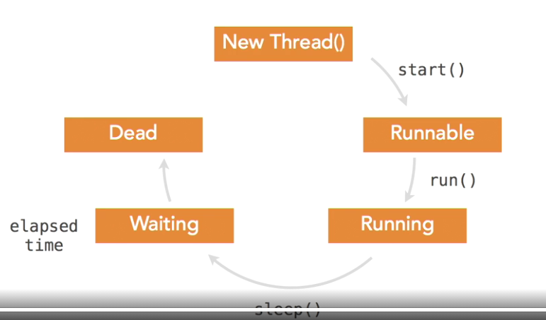

# Learning-Java
# OOP

- OOP is a model that is to represent real world object (and their relationship) in programming.
- It provides components to transform objects containing properties and functions.
- Almost every modern language(like c++, python, ruby, c#, java, etc) follow OOP model

# There are mainly four components of OOP

- Encapsulation
- Inheritance
- Abstraction
- Polymorphism

# what is an Object?

- Any entity that has state and behavior is known as an object. For example
a chair, pen, table, keyboard, bike , etc.
- It can be physical or logical
- An object can be defined as an instance of a class.
- An object contains an address and take up some space in memory.
- Object can communicate without knowing the details of each other's data or code.
- The only necessary thing is the type of message accepted  and the type of response by the objects.
- Ex => A dog is an object because it has state like color, name, breed, etc. as well as behaviors like wagging the tail, barking, etc.

# What is a Claas?

- Collection of objects is called class. It is logical entity.
- A class can also be defined as a blueprint from which you can create an individual object. Class doesn't consume any space.

# Inheritance 

- when one object acquires all the properties and behaviors of a parent object, it is known as a inheritance. It provides code 
reusability. It is used to achieve runtime polymorphism.
  
# Polymorphism

- If one task is performed in different ways. it is known as polymorphism. 
For example : to convince the customer differently, to draw something, for example, shape, triangle, rectangle, etc.
- Poly - many , morph - form ,
  
- In java, we use method overloading and method overriding to achieve polymorphism.
- Another example can be to speak something; for example, a cat speaks meow, dog barks woof, etc.
- There are 2 type 

  - Static / Method Overloading
  - Dynamic / Method overriding
# Abstraction

- Hiding internal details and showing functionality is known as abstraction. For example phone call, we don't know the internal processing.
- In Java, We use abstract class and interface to achieve abstraction.

# Encapsulation 

- Binding (or wrapping) code and data together into a single unit are known as encapsulation. For example, a capsule, it is wrapped with different medicines.
- A java class is the example of encapsulation. Java bean is the fully encapsulated class because all the data members are private here.

# static

- Fixed to a class, so it cannot be personalized by any instances of that class
- If static is in front of a method, you dont need an instance to invoke it.
# Coupling 

- Coupling refers to the knowledge or information or dependency of another class. It arises when classes are aware of each other. 
- if a class has the details' information of another class, there is strong coupling.
- In java, we use private, protected, and public modifiers to display the visibility level of a class, method, and field.
- You can use interfaces for the weaker coupling because there is no concrete implementation.

# Cohesion

- Cohesion refers to the level of component which performs a single well-defined task. A single well-defined task is done by a highly cohesive method.
- The weakly cohesive method will split the task into separate parts.
- The java.io package is a highly cohesive package because it has I/O related classes and interface.
- However, the java.util package is a weakly cohesive package because it has unrelated classes and interfaces.

# Association

- Association represents the relationship between the objects. Here, one object can be associated with one object or many objects.
- There can be four types of association between the objects:

    - One to One
    - One to Many
    - Many to One 
    - Many to Many
    
- Let's understand the relationship with real-time examples. For example, One country can have one prime minster (one to one),
- And a prime minster can have ministers (one to many).
- Also, many Mp's can have one prime minster (many to one), and many minsters can have many departments (many to many)
- Association can be unidirectional or bidirectional

# Aggregation

- Aggregation is a way achieve Association.
- Aggregation represents the relationship where one object contains other objects as a part of its state.
- It represents the week relationship between objects.
- It is also termed as a has-a relationship in Java.
- Like, inheritance represents the is-a relationship.
- It is another way to reuse objects.

# Composition

- The composition is also a way to achieve Association. The composition represents the relationship where one object contains other objects as a part of its state.
- There is a strong relationship between the containing object and the dependent object.
- It is the state where containing objects do not have an independent existence.
- If you delete the parent object, all the child objects will be deleted automatically.

# Thread in Java

- Every java program has a default main thread
- A thread is an independent path of code execution
- Many threads can run concurrently in jva program
- Thread can be used to perform time-intensive tasks
- Runnable are objects that encapsulate code sequences
- Each thread executes a runnable object
- Threads can initiate as asynchronous task.
- Asynchronous indicates that it can run concurrently
- The JVM gives each thread its own private JVM stack.
- The prevents threads from interfering with each other
- The stack holds local variables.
- It also tracks next instructions and calls methods.
- Java supports threads through java.lang.Thread class and the jav.lang.Runnable interface
- Threads are either daemon or non-daemon
- Daemon threads don't stop the JVM from ending
- Threads by default are non-daemon threads.
- Java garbage collection run on a daemon thread.
- A daemon thread is created calling setDaemon(true)
- The main thread is a non-daemon thread

# Create a Thread

- There are two ways to create a thread
    - Declare a new class as a subclass of the Thread class
    - Must override the run() method
    - An instance of this subclass can be allocated and started

    - Implement the runnable interface
    - Create a new class that implements Runnable
    - Create a Runnable object and use a Thread Constructor
    - Still must override the run() method
  
# Thread State 

- Each thread object has a state.
- State includes name, alive/dead, execution state and priority, and priority,
and a daemon/non-daemon status.
  
- Each attribute has a get/set method associated with it.

# Execution State of a Thread

- New - created but not started
- Runnable - a thread executing in the JVM
- Blocked - blocked waiting for a monitor to be unlocked
- Waiting - waiting to be notified
- Timed_waiting - waiting with a time limit
- Terminated - a thread that has completed execution

  
